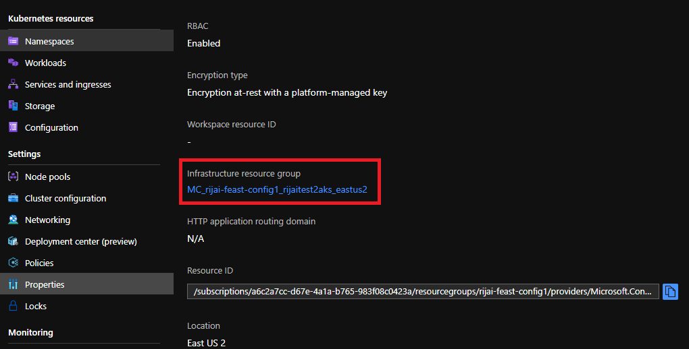

# Security Best Practices

## Overview
This document presents some security best practices about how to keep your feature store secured.

## Networking Security

### Configure virtual network
By default, the Azure Feast installation will create a new virtual network for the AKS cluster using kubenet. You can find the virtual network and associated Azure resources in the AKS infrastructure resource group:

If you want to use an existing virtual network or use Azure-CNI, you need to create the AKS cluster manually and config the network before running the installation script. For more details, please see:
- [Create AKS cluster using kubenet](https://docs.microsoft.com/azure/aks/configure-kubenet).
- [Create AKS cluster using Azure CNI](https://docs.microsoft.com/azure/aks/configure-azure-cni).

### Restrict access to Feast Core service using internal load balancer
By default, the Azure Feast installation will create a standard load balancer and expose the Feast Core service pod to public. If you want to restrict access to your Feast Core service to the same virtual network, you can create a internal load balancer to replace the standard one.

To more details about how to create a internal load balancer, please see [this documentation](https://docs.microsoft.com/azure/aks/internal-lb).

### Create controller and configure TLS
By default, the Feast Core service is exposed through the load balancer on http. To transfer data through the network secured, you can create an HTTPS NGINX ingress controller in the AKS cluster with TLS.

To learn more about how to create the NGINX ingress controller and configure TLS, please see:
- [Create an HTTPS ingress controller and use your own TLS certificates](https://docs.microsoft.com/azure/aks/ingress-own-tls)
- [Create an HTTPS ingress controller and use Let's Encrypt - dynamic public IP](https://docs.microsoft.com/azure/aks/ingress-tls)
- [Create an HTTPS ingress controller and use Let's Encrypt - static public IP](https://docs.microsoft.com/azure/aks/ingress-static-ip)

## Authentication and Authorization

### Authentication
Feast Core service support authentication using Open ID Connect tokens. You can enable this feature and use Azure Active Directory token (which is ) for authentication.

To learn more about how to enable authentication, please see [the Authentication section in Feast documentaion](https://docs.feast.dev/v/v0.9-branch/advanced/security#authentication).

### Authorization
Feast support you configure authorization using a external authorization server that implements the Authorization Open API sepcification.

To learn more about how to enable authorization, please see [the Authorization section in Feast documentaion](https://docs.feast.dev/v/v0.9-branch/advanced/security#authorization)
